# DO5_SimpleDocker_s21_lemongrb

## Part 1. Готовый докер

* Выкачаем официальный докер-образ с nginx при помощи `sudo docker pull nginx`:

  <div align=center>

  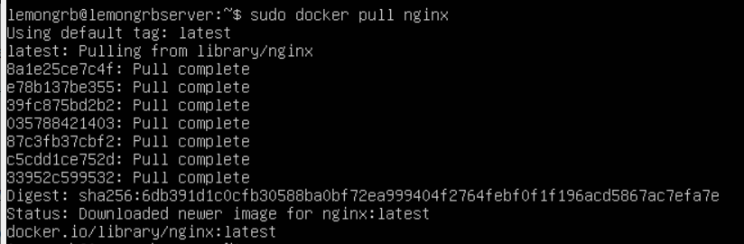

  *Выкачали образ nginx*
  </div>

* Проверим наличие докер-образа через `sudo docker images`:

  <div align=center>

  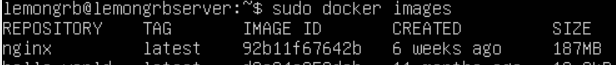

  *Образ nginx присутствует*
  </div>

* Запустим докер-образ через `sudo docker run -d nginx`:

  <div align=center>

  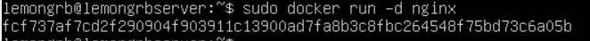

  *Запустили образ nginx*
  </div>

* Проверим, что образ запустился через `sudo docker ps`:
  
  <div align=center>

  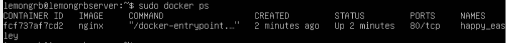

  *Образ nginx запущен*
  </div>

* Посмотрим информацию о контейнере в формате JSON через `sudo docker inspect fcf737af7cd2`:
  <div align=center>

  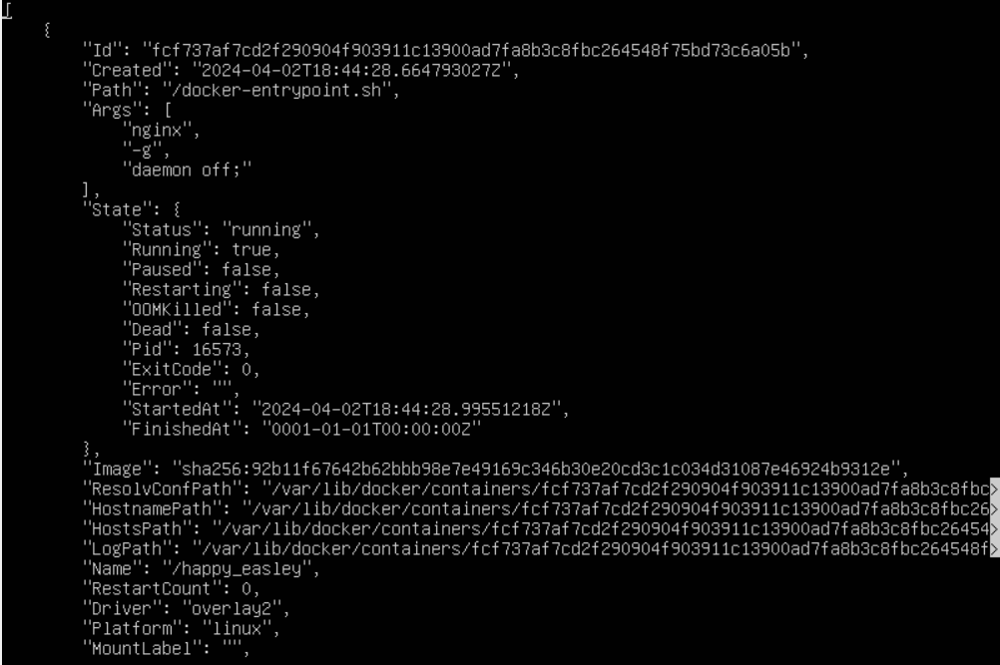

  *Начало вывода команды docker inspect*
  </div>

* Определим размер контейнера, список замапленных портов и ip контейнера:

  * размер контейнера - `sudo docker ps -s`:

    <div align=center>

    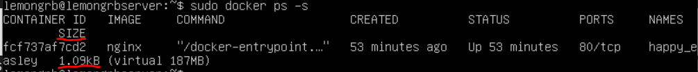

    *Размер контейнера 1.09kB*
    </div>
  
  * список замапленных портов:
    
    Замапленные порты – это порты, которые были связаны между собой при создании сетевого соединения между двумя узлами сети. Обычно замапленные порты используются для предоставления доступа к сетевым сервисам, запущенным в контейнерах Docker, извне контейнера:

    <div align=center>

    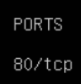

    *80 порт замаплен*
    </div>

  * ip контейнера:

    <div align=center>

    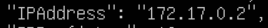

    *ip котейнера 172.17.0.2*
    </div>

  * Остановим докер образ через `sudo docker stop happy_easley`:

    <div align=center>

    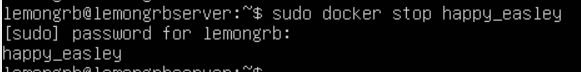

    *Остановили докер образ nginx*
    </div>

  * Проверим, что образ остановился через `sudo docker ps`:

    <div align=center>

    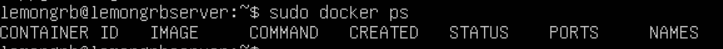

    *Образа nginx нет в таблице, значит остановлен*
    </div>

  * Запустим докер с портами 80 и 443 в контейнере, замапленными на такие же порты на локальной машине, через команду - `sudo docker run -d -p 80:80 -p 443:443 nginx`. Эта команда создаст контейнер из образа nginx и замаплит порт 80 контейнера на порт 80 хост-системы, а также порт 443 контейнера на порт 443 хост-системы. Это значит, что любой трафик, поступающий на порты 80 и 443 хост-системы, будет перенаправлен на соответствующие порты контейнера.

    <div align=center>

    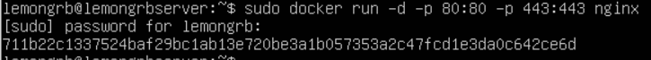

    *Запустили образ nginx с замапленными портами 80 и 443*
    </div>

  * Проверим, что в браузере lynx по адресу localhost:80 доступна стартовая страница nginx:
    <div align=center>

    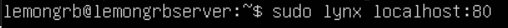

    *Запускаем браузер lynx с localhost:80*
    </div>

    <div align=center>

    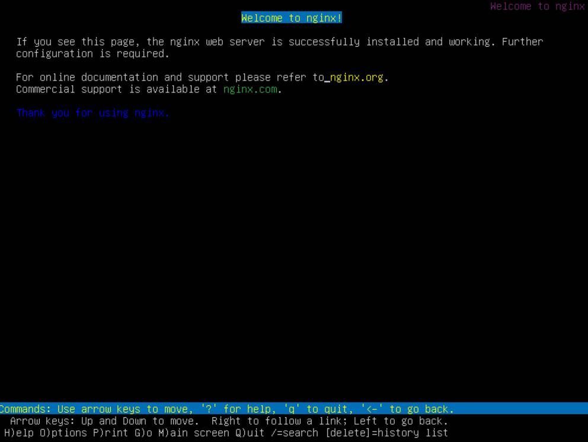

    *Стартовая страница nginx в браузере lynx*
    </div>

  * Перезапустим докер контейнер через `sudo docker restart stupefied_kirch`:

    <div align=center>

    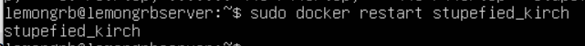

    *Перезапускаем контейнер с nginx*
    </div>

  * Проверим, что контейнер запустился - `sudo docker ps`:

    <div align=center>

    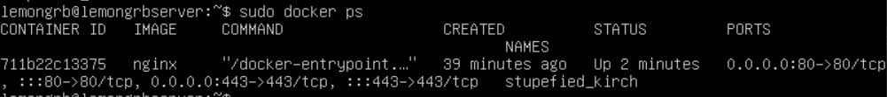

    *Контейнер stupefied_kirch запущен*
    </div>

## Part 2. Операции с контейнером

* Прочитаем конфигурационный файл nginx.conf внутри докер контейнера через команду `sudo docker exec -it stupefied_kirch cat /etc/nginx/nginx.conf`:

    <div align=center>

    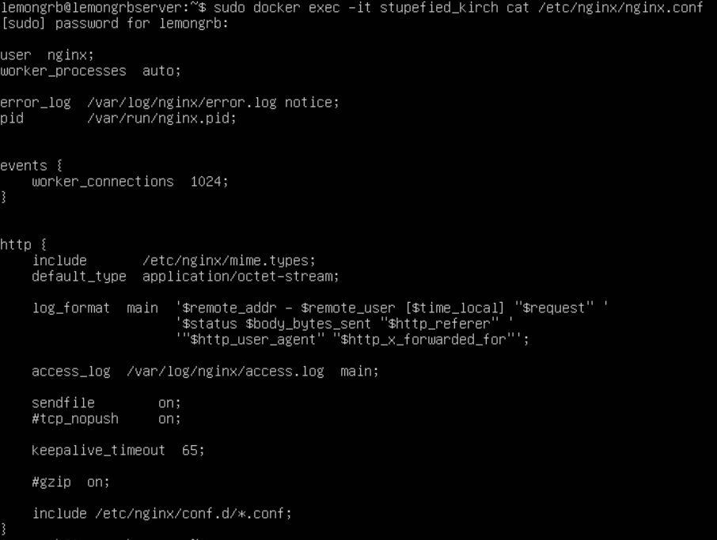

    *Прочитываем конфигурационный файл с помощью команды docker exec*
    </div>

  Команда `exec` в Docker используется для выполнения команды внутри запущенного контейнера. Эта команда позволяет взаимодействовать с процессами внутри контейнера, выполнять задачи управления и получать доступ к файловой системе контейнера.

  Когда выполняется команда `docker exec`, Docker создает новый процесс внутри существующего контейнера и выполняет указанную команду. Этот новый процесс работает параллельно с основным процессом контейнера и может взаимодействовать с ним.

  Флаг `-it` - Docker выделяет псевдотерминал для команды, выполняемой внутри контейнера, и связывает его со стандартным вводом, выводом и ошибками (stdin, stdout и stderr) локального терминала. Это позволяет взаимодействовать с командой, выполняемой внутри контейнера, так же, как если бы она выполнялась непосредственно в локальном терминале.

* Создадим на локальной машине файл nginx.con - `touch nginx.con`.

    <div align=center>

    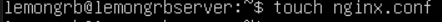

    *Создание файла nginx.conf*
    </div>

* Настроем в файле nginx.con по пути /status отдачу страницы статуса сервера nginx:
  скопируем содержимое конфигурационного файла контейнера на локальную машину - `sudo docker exec -it stupefied_kirch cat /etc/nginx/nginx.conf > nginx.conf` и откроем файл на локальной машине - `sudo nano nginx.conf` + пропишем строки, которые добавляют по пути /status отдачу страницы статуса сервера nginx:

  `server {
       listen 80;
       location = /status {
            stub_status on;
       }
  }`

    <div align=center>

    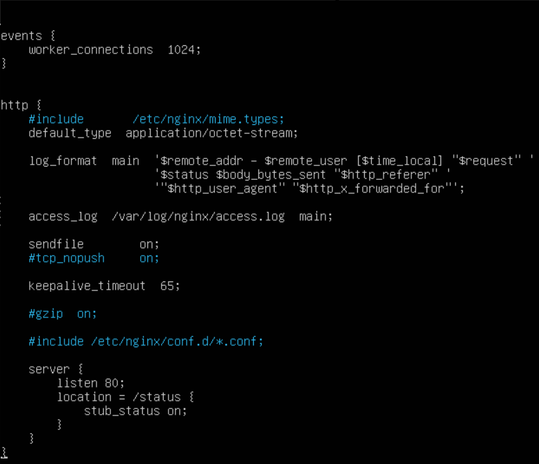

    *Настройка отдачи страницы статуса сервера nginx*
    </div>

* Скопируем созданный файл nginx.conf внутрь докер-образа через команду - `docker cp nginx.conf brave_dijkstra:/etc/nginx/nginx.conf`:
    <div align=center>

    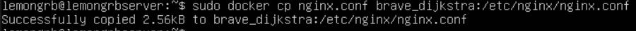

    *Скопировали файл nginx.conf внутрь докер-образа*
    </div>

* Перезапустим nginx внутри докер-образа через команду - `docker exec -it brave_dijkstra njinx -s reload`:

  <div align=center>

  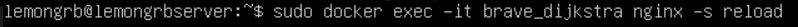

  *Перезапускаем nginx*
  </div>

* Проверим, что по адресу localhost:80/status отдается страничка со статусом сервера nginx:

  <div align=center>

  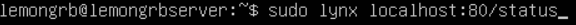

  *Запускаем страницу localhost:80/status в браузере lynx*
  </div>

  <div align=center>

  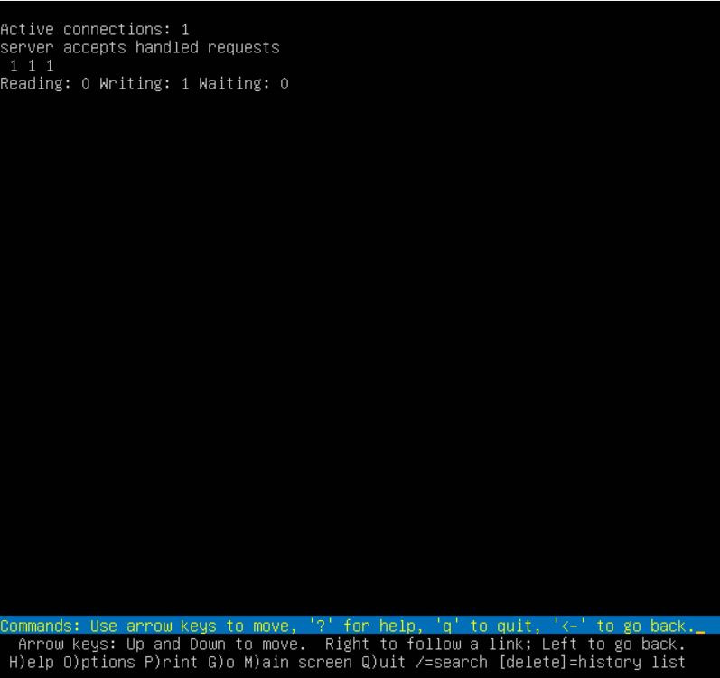

  *Страница со статусом сервера nginx*
  </div>

* Экспортируем контейнер в файл container.tar через команду export - 
`sudo docker export brave_dijkstra > container.tar`:

  <div align=center>

  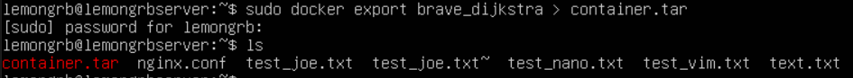

  *Новый файл container.tar с контейнером*
  </div>

* Остановим контейнер `sudo docker stop brave_dijkstra`:

  <div align=center>

  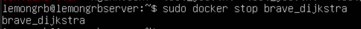

  *Остановили контейнер brave_dijkstra*
  </div>

* Удалим образ nginx через `sudo docker rmi 92b11f67642b`, не удаляя перед этим контейнеры:

  <div align=center>

  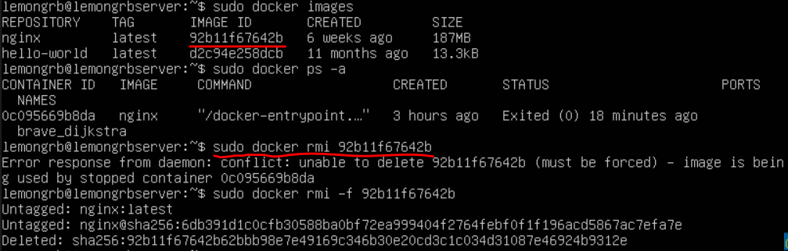

  *Удаляем принудительно образ -f, т.к. он еще используется остановленным контейнером brave_dijkstra*
  </div>

* Удалим остановленный контейнер (узнаем id остановленного контейнера через `docker ps -a` или имя контейнера brave_dijkstra через names) - `sudo docker rm 0c095669b8da`:

  <div align=center>

  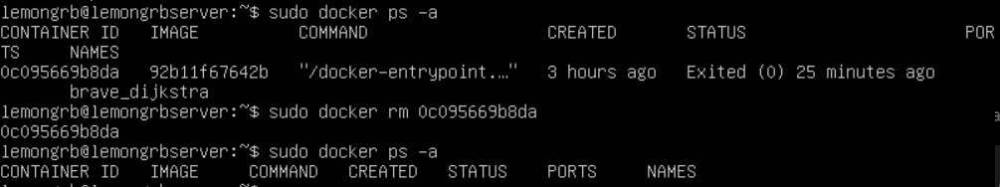

  *Удаляем остановленный контейнер brave_dijkstra*
  </div>

* Импортируем контейнер обратно через команду `sudo docker import -c 'cmd ["nginx", "-g", "daemon off;"]' container.tar newnginx`:

  <div align=center>

  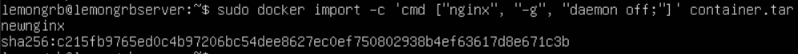

  *Импортируем контейнер с nginx обратно*
  </div>

  Команда `docker import` используется для импорта содержимого тарифного архива в новый образ Docker: 
  
  * Опция `-c` используется для переопределения команды по умолчанию, указанной в Dockerfile, при импорте образа;

  * Опция `CMD` в Dockerfile используется для установки команды по умолчанию, которая будет выполнена при запуске контейнера; 
  
  * Опция `-g` используется для установки глобальных директив конфигурации nginx. Директива `daemon off;` указывает nginx запускаться в переднем плане, без демонизации. Это необходимо для корректной работы nginx внутри контейнера Docker.


* Запустим импортированный контейнер `sudo docker run -d -p 80:80 -p 443:443 newnginx`:

  <div align=center>

  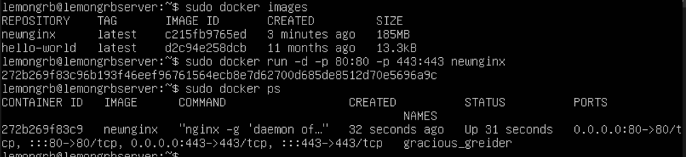

  *Контейнер nginx gracious_greider запущен*
  </div>

* Проверим, что по адресу localhost:80/status отдается страничка со статусом сервера nginx:

  <div align=center>

  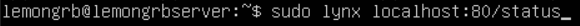

  *Запускаем браузер lynx с адресом localhost:80/status*
  </div>

  <div align=center>

  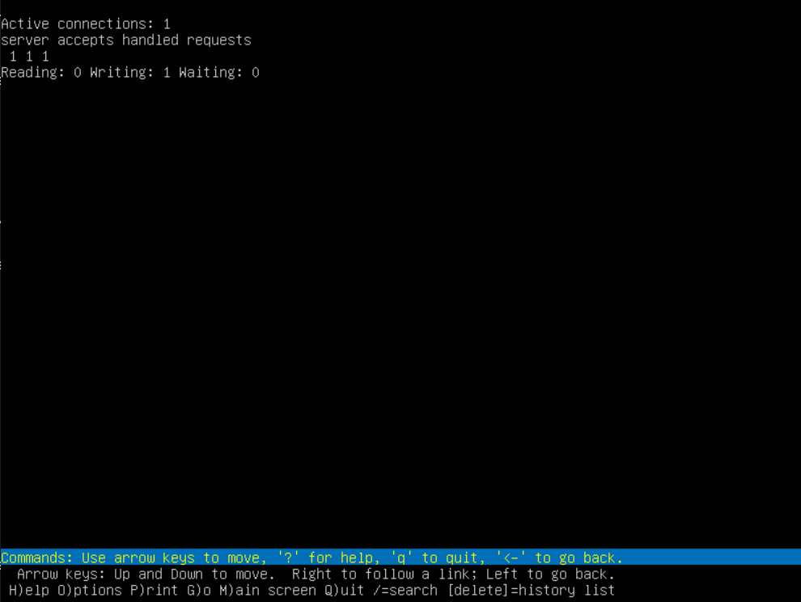

  *localhost:80/status запускается*
  </div>

## Part 3. Мини веб-сервер

* Напишем мини-сервер на C и FastCgi, который будет возвращать простейшую страничку с надписью "Hello World!". Для этого создадим файл /server/server.c и напишем там следующий код:

  <div align=center>

  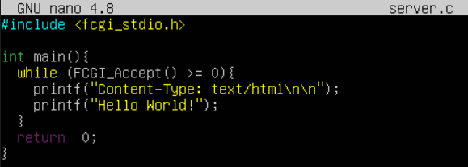

  *Мини-сервер на C и FastCgi*
  </div>

* **FastCGI** (Fast Common Gateway Interface) - это протокол, который позволяет веб-серверу передавать запросы клиентов в приложение и получать от него ответ. Приложение FastCGI запускается как отдельный процесс и подключается к веб-серверу через сокет. Веб-сервер передает запросы клиентов в приложение через этот сокет и получает от него ответ.

  **fcgi_stdio.h** - это заголовочный файл библиотеки FastCGI, который содержит определения функций для работы со стандартными потоками ввода-вывода FastCGI-приложения, такими как FCGI_Accept и другими, определения констант и структур данных. Эти функции позволяют приложению получать данные от веб-сервера, обрабатывать их и отправлять ответ клиенту.

  **FCGI_Accept** - это функция из библиотеки FastCGI, которая используется для приема в цикле обработки запросов от веб-сервера в FastCGI-приложении. Она блокирует выполнение приложения до тех пор, пока не будет получен новый запрос от веб-сервера. Когда запрос получен, функция FCGI_Accept заполняет структуру FCGI_Request, которая содержит информацию о запросе, такую как метод, URI, заголовки и тело запроса. После того как запрос получен и обработан, FastCGI-приложение должно вернуть ответ веб-серверу.

  **Content-Type: text/html\n\n** - это заголовок HTTP-ответа, который указывает, что тип контента, который будет отправлен клиенту, является HTML-документом. Заголовок **Content-Type** является обязательным заголовком в HTTP-ответе, который указывает тип контента, который будет отправлен клиенту. Значение **text/html** указывает, что контент представляет собой HTML-документ. Символы \n в конце строки представляют собой символы перевода строки, которые используются для разделения заголовков и тела ответа. Первый символ \n указывает конец заголовка Content-Type, а второй символ \n указывает начало тела ответа.

* Cкомпилируем файл server.c `gcc -o server server.c -lfcgi` и запустим написанный мини-сервер через spawn-fcgi на порту 8080 `sudo spawn -fcgi -a 127.0.0.1 -p 8080 -f ./server`:

  <div align=center>

  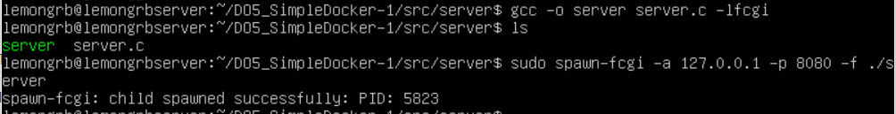

  *Запустили мини-сервер через spawn-fcgi на порту 8080*
  </div>

  Когда эта команда выполняется, утилита spawn-fcgi запускает FastCGI-приложение server и связывает его с сетевым сокетом, который слушает запросы на IP-адресе 127.0.0.1 и порту 8080. Затем FastCGI-приложение начинает обрабатывать входящие запросы и отправлять ответы клиенту.

  * `-a 127.0.0.1` - это параметр, который указывает IP-адрес, на котором будет запущен сервер FastCGI. В этом случае используется локальный адрес (127.0.0.1), что означает, что сервер будет доступен только с локальной машины;

  * `-p 8080` - это параметр, который указывает номер порта, на котором будет запущен сервер FastCGI. В этом случае используется порт 8080;
  * `-f ./server` - это параметр, который указывает путь к исполняемому файлу FastCGI-приложения. В этом случае используется файл server, который находится в текущем каталоге.

* Напишем свой /etc/nginx/nginx.conf, который будет проксировать все запросы с 81 порта на 127.0.0.1:8080:

  <div align=center>

  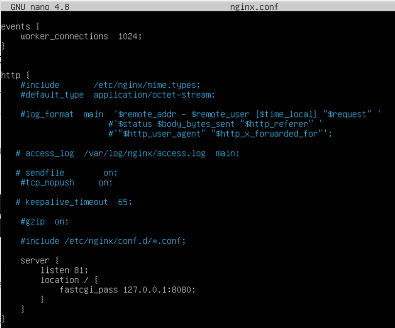

  *Содержимое nginx.conf*
  </div>

  В этом файле конфигурации nginx настроен на прослушивание 81 порта и перенаправление всех запросов на 127.0.0.1:8080 с использованием протокола FastCGI.

  Директива `fastcgi_pass` указывает nginx перенаправлять запросы на указанный адрес с использованием протокола FastCGI.

* Перезапустим nginx, чтобы применить изменения в файле конфигурации - `sudo systemctl restart nginx` и проверим работающие порты с помощью `sudo netstat -tuln`:

  <div align=center>

  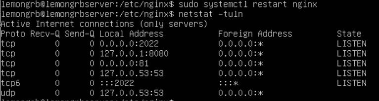

  *81 порт слушает*
  </div>

* Проверим, что в браузере lynx по localhost:81 отдается написанная страничка `sudo lynx localhost:81`:

  <div align=center>

  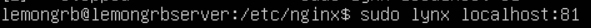

  *Запускаем браузер lynx с адресом localhost:81*
  </div>

  <div align=center>

  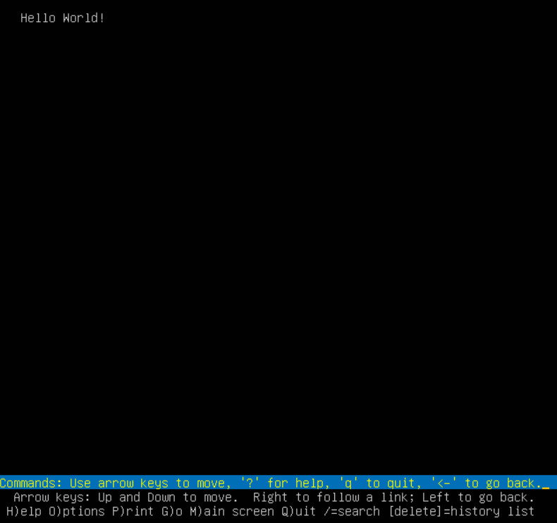

  *Мини-сервер возвращает страничку с "Hello World!"*
  </div>

* Положим файл nginx.conf по пути ./nginx/nginx.conf:

  <div align=center>

  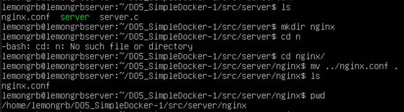

  *Положили файл nginx.conf в указанную директорию*
  </div>

## Part 4. Свой докер

* Напишем свой докер-образ, который:

  1) собирает исходники мини сервера на FastCgi из Части 3;

  2) запускает его на 8080 порту;

  3) копирует внутрь образа написанный ./nginx/nginx.conf;

  4) запускает nginx.

  <div align=center>

  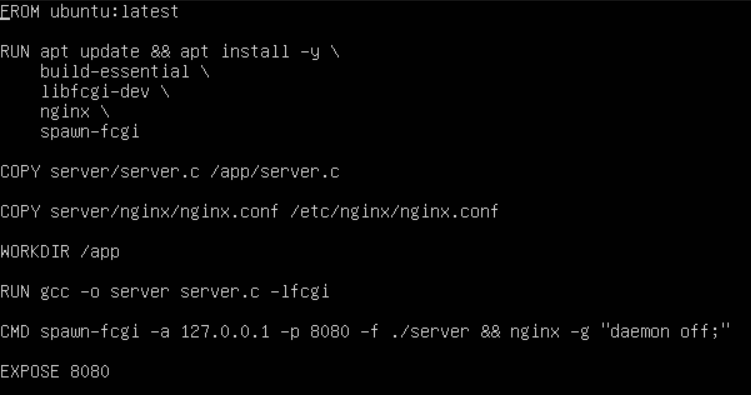

  *Dockerfile*
  </div>

  **FROM ubuntu:latest** - это строка, указывающая на базовый образ для создаваемого Docker-образа. Это официальный образ операционной системы Ubuntu, который размещен на Docker Hub. Этот образ содержит базовую систему Ubuntu с набором стандартных пакетов и библиотек, необходимых для запуска приложений;

  **build-essential** - это пакет в Ubuntu и других дистрибутивах Linux, основанных на Debian, который содержит набор основных инструментов для компиляции и сборки программного обеспечения из исходных кодов (например: gcc, make, libc6-dev, linux-libc-dev и т.д.);

  **libfcgi-dev** - это пакет разработчика для библиотеки FastCGI, который содержит файлы заголовков и статическую библиотеку для разработки приложений FastCGI;

  **spawn-fcgi** - это утилита, которая используется для запуска приложений FastCGI в фоновом режиме. FastCGI - это протокол, который позволяет веб-серверу взаимодействовать с приложениями, которые генерируют динамический контент;

  **WORKDIR /app** - это инструкция в Dockerfile, которая устанавливает текущий рабочий каталог для последующих инструкций в Dockerfile. Все последующие инструкции (COPY, RUN, CMD и т.д.), будут выполняться в каталоге /app.

  **RUN gcc -o server server.c -lfcgi** - выполняется сборка мини-сервера с помощью gcc и флага -lfcgi для подключения библиотеки FastCGI.

  **CMD** - это инструкция в Dockerfile, которая устанавливает команду, которая будет выполняться при запуске контейнера. Если при запуске контейнера не указана команда с помощью параметра docker run, то будет выполнена команда, указанная в CMD.

  **nginx -g "daemon off;""** - при запуске контейнера запустится веб-сервер nginx в переднем плане, без демонизации;

  **EXPOSE 8080** - контейнер будет слушать порт 8080.

* Соберем написанный докер-образ через docker build при этом указав имя и тег - `sudo docker build -t myserver:1.0 .`:

  <div align=center>

  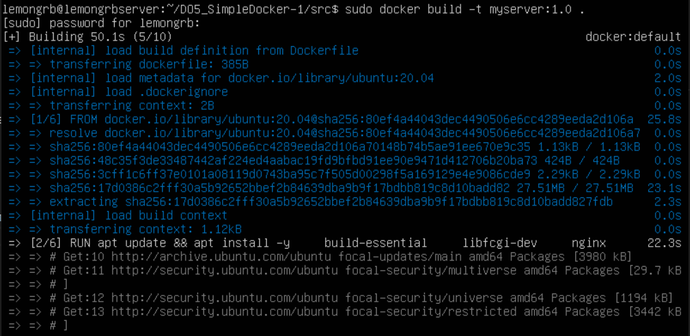

  *Докер-образ myserver собирается*
  </div>

  <div align=center>

  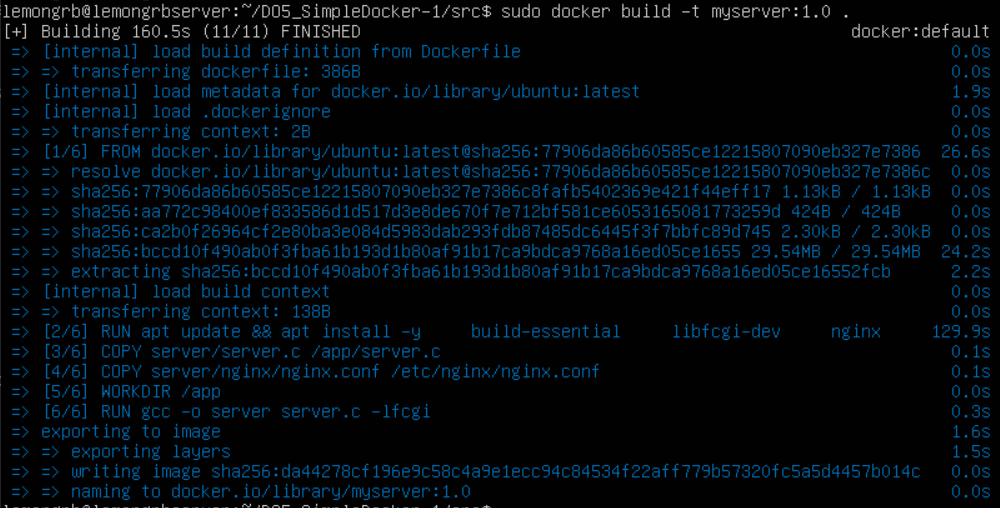

  *Докер-образ myserver собирался*
  </div>

* Проверим через `sudo docker images`, что все собралось корректно:

  <div align=center>

  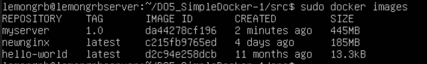

  *Новый докер-образ myserver существует*
  </div>

* Запустим собранный докер-образ с маппингом 80 порта на локальной машине на 81 порт контейнера и маппингом папки ./nginx внутрь контейнера по адресу, где лежат конфигурационные файлы nginx'а - `sudo docker run -p 80:81 -v $(pwd)/server/nginx/nginx.conf:/etc/nginx/nginx.conf myserver:1.0`:

  <div align=center>

  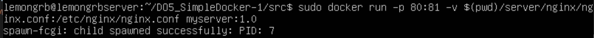

  *Запустили контейнер*
  </div>

  `-v` (volume) используется для подключения тома или папки на хост-системе к контейнеру.

* Проверим новый контейнер в списке контейнеров `sudo docker ps`:

  <div align=center>

  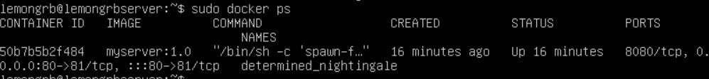

  *Новый контейнер determined_nightingale на основе образа myserver:1.0*
  </div>

* Проверим, что в браузере lynx по localhost:80 доступна страничка написанного мини сервера `sudo lynx localhost:80`:

  <div align=center>

  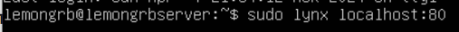

  *Запускаем браузер lynx со страницей localhost:80*
  </div>

  <div align=center>

  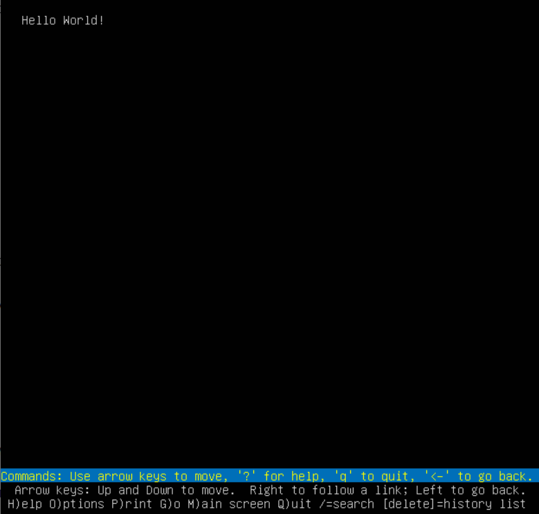

  *Адрес localhost:80 доступен - Hello World! выводится*
  </div>

* Допишем на локальной машине в server/nginx/nginx.conf проксирование странички /status, по которой надо отдавать статус сервера nginx:

  <div align=center>

  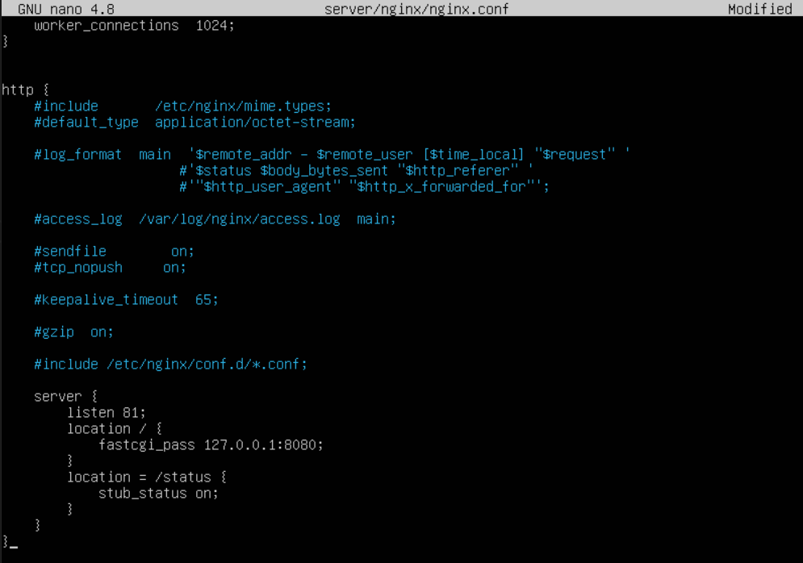

  *Дописали страницу /status*
  </div>

* Перезапустим контейнер **determined_nightingale**:

  <div align=center>

  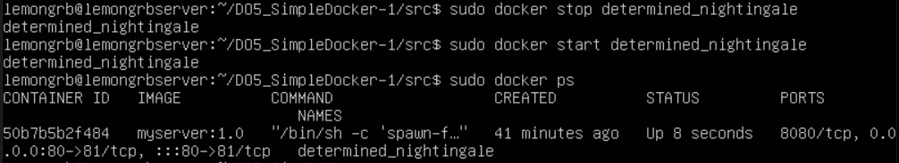

  *Перезапуск контейнера*
  </div>

  После сохранения файла и перезапуска контейнера, конфигурационный файл внутри докер-образа должен обновиться самостоятельно.

* Проверим, что теперь в бразуер lynx по localhost:80/status отдается страничка со статусом nginx:

  <div align=center>

  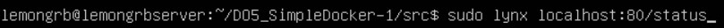

  *Запускаем браузер lynx*
  </div>

  <div align=center>

  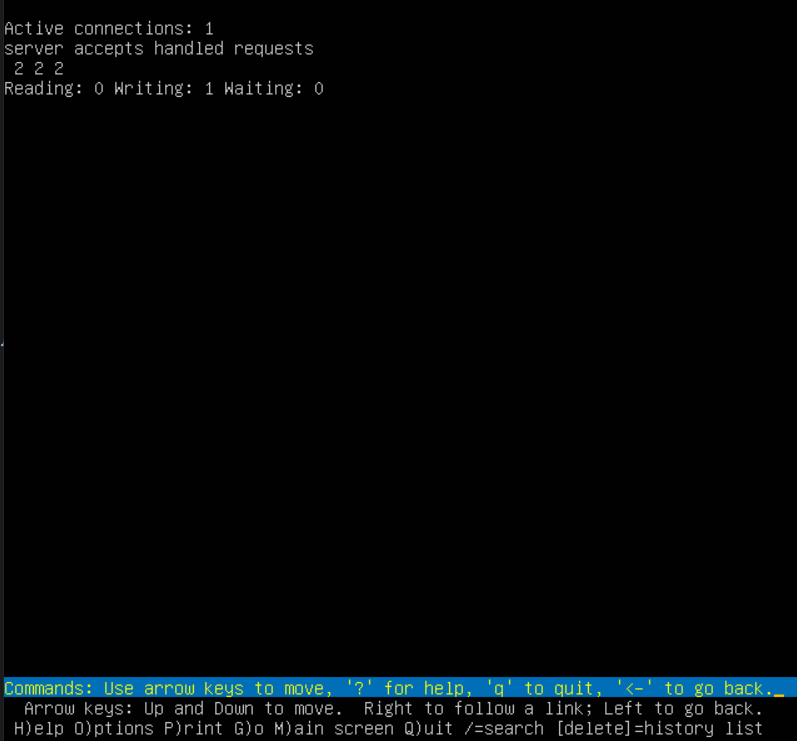

  *localhost:80/status запускается*
  </div>

## Part 5. Dockle

**Dockle** - это инструмент для проверки безопасности Docker-образов. Этот инструмент анализирует Dockerfile и образ Docker, чтобы проверить их на соответствие рекомендациям по безопасности, разработанным сообществом Docker.

Dockle проверяет Docker-образ на наличие уязвимостей, небезопасных конфигураций, устаревших пакетов и других проблем, которые могут представлять угрозу безопасности. Он также предоставляет рекомендации по устранению обнаруженных проблем.

* Просканируем образ из предыдущего задания через `sudo dockle myserver:1.0`:

  <div align=center>

  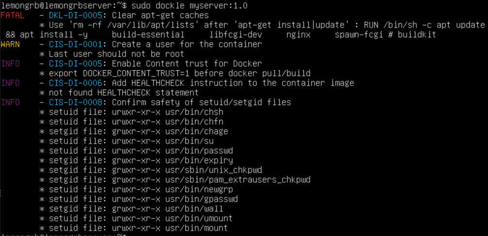

  *Вывод команды dockle*
  </div>

  Виды сообщений dockle из скрина выше:

  **Fatal**: Это критические ошибки, которые делают контейнер небезопасным или неработоспособным. Вы должны исправить все фатальные ошибки перед развертыванием контейнера.

  **Warn**: Это предупреждения, которые указывают на потенциальные проблемы, которые могут вызвать проблемы в будущем. Хотя ваш контейнер может работать правильно сейчас, рекомендуется исправить эти предупреждения, чтобы избежать будущих проблем.

  **Info**: Это информационные сообщения, которые предоставляют полезные рекомендации по улучшению вашего контейнера. Они не являются обязательными для исправления, но их рекомендуется учитывать.

* Исправим образ так, чтобы при проверке через dockle не было ошибок и предупреждений:

  * Сообщение об ошибке "DKL-DI-0005" - удаление кэша пакетов после установки пакетов в контейнере Docker. Кэш пакетов может занимать много места в контейнере, и его можно безопасно удалить после установки пакетов ```RUN apt clean && rm -rf /var/lib/apt/lists/```.

  * Сообщение об ошибке "CIS-DI-0001" - создание пользователя для контейнера Docker. Это важно, потому что запуск контейнера от имени пользователя root может создать риски для безопасности. Чтобы исправить ошибку, нужно создать нового пользователя в Dockerfile и переключиться на него перед запуском приложения:
    ```
    RUN groupadd -r cont_group && \
        useradd -r -g cont_group cont_user

    USER cont_user
    ```

  * Сообщение об ошибке "CIS-DI-0005" - включение проверки подлинности контента (Docker Content Trust (DCT)) для Docker. Проверка подлинности контента помогает защитить приложение от несанкционированных изменений и злонамеренных атак. Для использования DCT необходимо настроить Docker для работы с DCT и подписать образ с помощью ключа, который был создан с использованием DCT.
  
  * Сообщение об ошибке "CIS-DI-0006" - добавление инструкции HEALTHCHECK в Dockerfile. Инструкция HEALTHCHECK помогает Docker мониторить состояние контейнера и автоматически перезапускать его в случае сбоя: `HEALTHCHECK --interval=5s --timeout=3s --retries=3 CMD [ "curl", "--fail", "http://localhost:81" ]`. Команда CMD [ "curl", "--fail", "http://localhost:81" ]отправляет HTTP-запрос на адрес http://localhost:81 и возвращает результат запроса. Она будет выполняться при запуске контейнера. Опция --fail указывает curl возвращать код ошибки, если сервер вернул код ошибки, отличный от 2xx;

  * Сообщение об ошибке "CIS-DI-0008" - безопасность файлов setuid и setgid в контейнере. Эти файлы могут предоставлять привилегии суперпользователя обычным пользователям, что может создать риски для безопасности, если они неправильно настроены или используются злоумышленниками: `chmod 600 filename` - только владелец файла может читать и писать в файл (filename), а другие пользователи не имеют никаких разрешений.

* Удалим образ myserver:1.0 и созданный в прошлом задании контейнер: `sudo docker rm && docker rmi`. Пропишем новые задачи для Dockerfile, решающие возникающие в Dockle проблемы:

  <div align=center>

  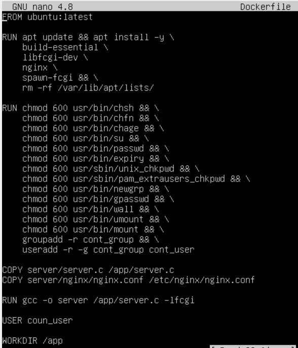

  *Содержимое Dockerfile с новыми задачами*
  </div>

  <div align=center>

  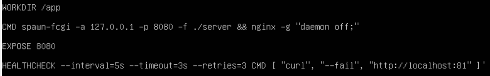

  *Содержимое Dockerfile с новыми задачами*
  </div>

* Создадим новый образ `sudo docker build -t myserver:1.0 .`: 

  <div align=center>

  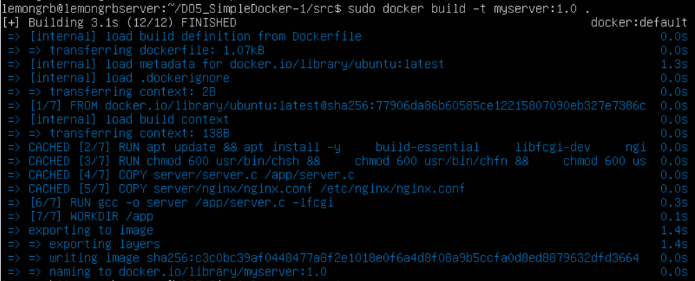

  *Создали образ myserver:1.0 заново с новыми задачами*
  </div>

* Снова проверим образ с помощью Dockle `sudo dockle myserver:1.0`:

  <div align=center>

  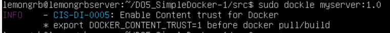

  *Фатальных ошибок и потенциальных проблем в образе не обнаружено myserver:1.0*
  </div>

## Part 6. Базовый Docker Compose

Docker Compose - это инструмент для определения и запуска многоконтейнерных приложений Docker. Он позволяет определить все службы, необходимые для приложения, в одном файле конфигурации, а затем запустить их все с одной командой.

* Напишем файл docker-compose.yml, с помощью которого:
  * Поднимем докер-контейнер из Части 5 (он должен работать в локальной сети, т.е. не нужно использовать инструкцию EXPOSE и мапить порты на локальную машину);

    <div align=center>

    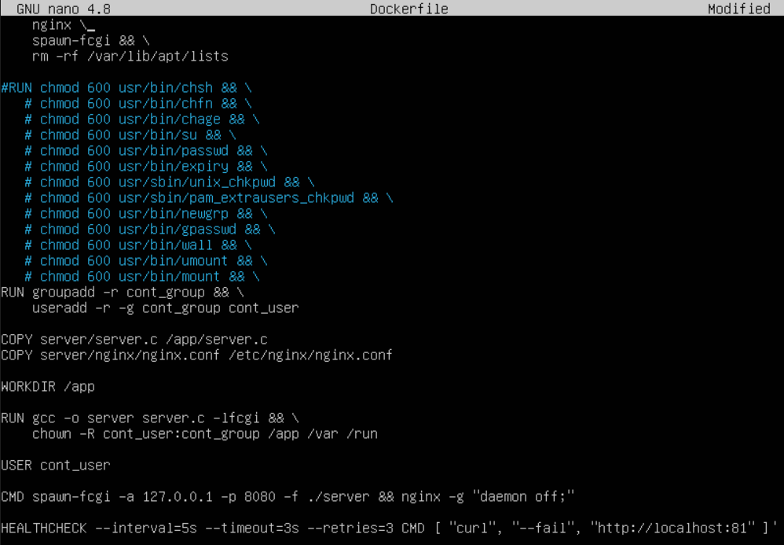

    *Содержимое Dockerfile без EXPOSE*
    </div>

  * Замапим 8080 порт контейнера с nginx на 80 порт локальной машины:

    <div align=center>

    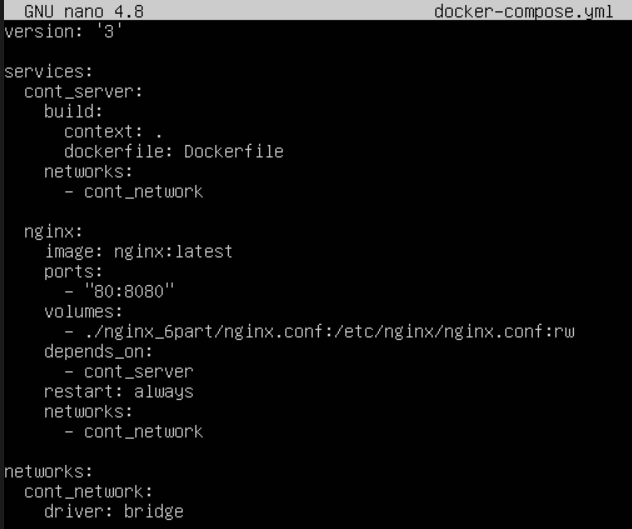

    *Содержимое docker-compose.yml (2 контейнера: server и nginx)*
    </div>

  * -volumes (тома) - это внешние директории, которые могут быть подключены к одному или нескольким контейнерам и используются для хранения данных, которые должны сохраняться между перезапусками контейнера.

* Поднимем докер-контейнер с nginx, который будет проксировать все запросы с 8080 порта на 81 порт певрого контейнера. Пропишем это в файле nginx_6part/nginx.conf:

  <div align=center>

  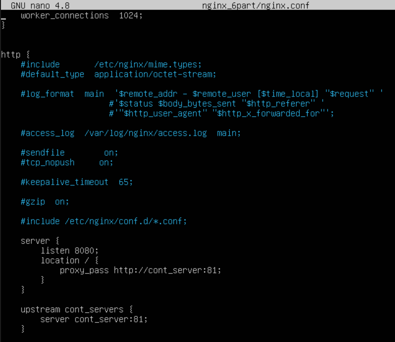

  *Файл nginx.conf контейнера с nginx*
  </div>

* Остановим все запущенные контейнеры `sudo docker stop $(docker ps -q)`.Команда docker ps -q выводит список идентификаторов всех запущенных контейнеров, а команда docker stop останавливает каждый контейнер из этого списка.

* Соберем и запустим проект с помощью команд docker-compose build и docker-compose up. `sudo docker-compose build` - эта команда соберет образы Docker для всех служб, указанных в файле docker-compose.yml. `docker-compose up` - эта команда запустит все службы, указанные в файле docker-compose.yml.

  <div align=center>

  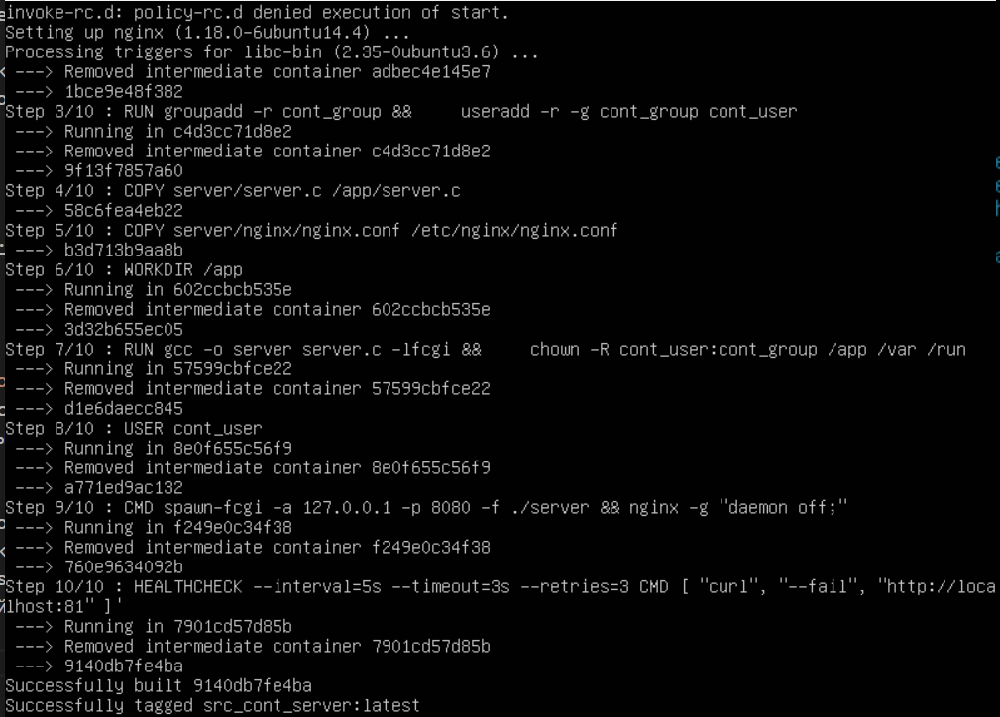

  *Вывод команды sudo docker-compose build*
  </div>

  <div align=center>

  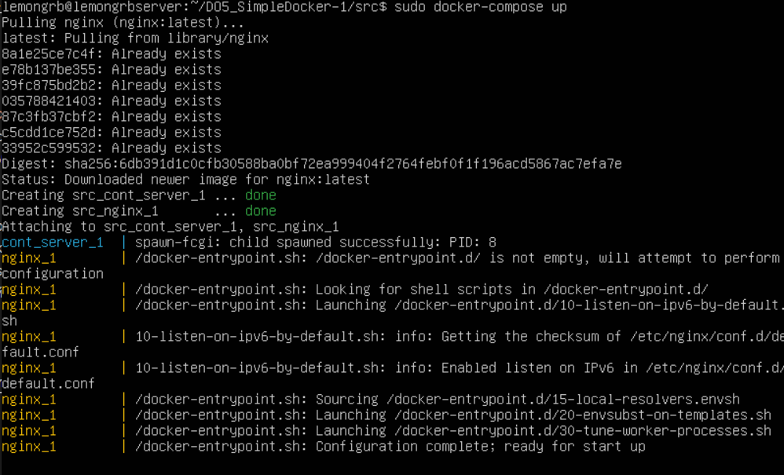

  *Вывод команды sudo docker-compose up*
  </div>

* Проверим, что в браузере lynx по localhost:80 отдается страничка, как и ранее `sudo lynx localhost:80`:

  <div align=center>

  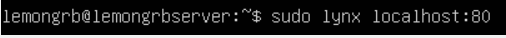

  *Команда запуска браузера lynx и страницы localhost:80*
  </div>

  <div align=center>

  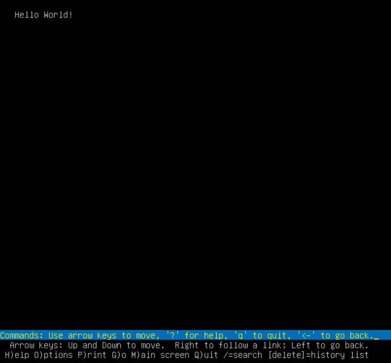

  *Страница localhost:80 отдается*
  </div>
